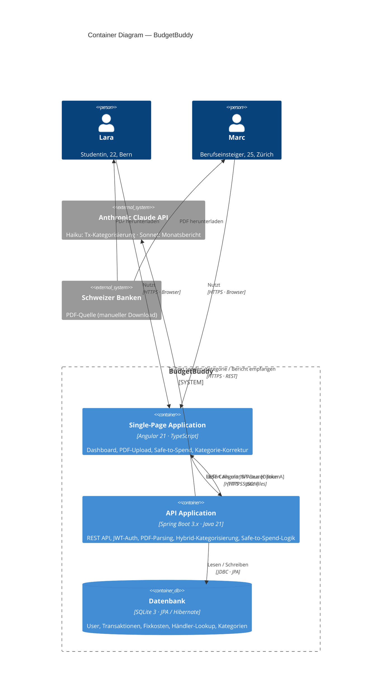

Erstelle ein C4 Container Diagram für unser Projekt.

Basierend auf unseren Quality Attributes aus Modul3/prompts_qa_jason.txt
und unserer Systemübersicht aus C1: docs/prompts/02_prompt_system_ctx_diagramm_jason.md

Fragen:
1. Welche Container brauchen wir? (Web App, API, DB, Cache?)
2. Welche Technologien passen zu unserem Team und QAs?
3. Wie kommunizieren die Container miteinander?
4. Begründe jeden Container in einem Satz.

Unser Team: 2-3 Devs, 3 Monate, gemischter Background.

-----

## C4 Container Diagram — BudgetBuddy



---

## Antworten auf die 4 Fragen

### 1. Welche Container brauchen wir?

| Container | Entscheid | Begründung |
|---|---|---|
| **Angular SPA** | Ja | Reaktive UI mit Fortschrittsanzeigen für PDF-Upload (QA2 Usability) |
| **Spring Boot API** | Ja | Zentralisiert JWT-Auth, Row-Level-Filter und BigDecimal-Logik auf dem Server (QA1 + QA3) |
| **SQLite DB** | Ja | Eine Datei auf Render Disk — CASCADE DELETE für nDSG, NUMERIC(15,2) für CHF (QA1 + QA3) |
| **Cache (Redis)** | **Nein** | MVP-Scope: wenige gleichzeitige User, SQLite-Reads < 10ms — 4. Service für null Gewinn |
| **Message Queue** | **Nein** | PDF-Parsing dauert ~1–2 s — synchron mit Spinner reicht für Lara (QA2), kein Kafka-Overhead |
| **Separate Worker** | **Nein** | PDF-Import läuft im API-Thread; Komplexität erst bei >100 gleichzeitigen Uploads nötig |

### 2. Welche Technologien passen zu Team und QAs?

| Schicht | Technologie | QA-Verbindung |
|---|---|---|
| Angular 21 + Signals | Reaktive UI ohne NgRx — 2-3 Devs können es ohne Redux-Denke pflegen | QA2: Fortschrittsanzeige, OnPush Change Detection |
| Spring Boot 3.x + Java 21 | Statisches Typsystem verhindert Klassen von Correctness-Bugs | QA3: BigDecimal-Enforcement durch Compiler, QA1: Spring Security out-of-the-box |
| JPA + Hibernate | Repository-Pattern: User-ID-Filter zentral in einer Basisklasse, nicht in jedem Query | QA1: Row-Level Security |
| SQLite + Flyway | Schema-Migrationen versioniert — kein "wer hat was in der DB geändert?" | QA3: Schema-Korrektheit, QA1: CASCADE DELETE in Migration |
| Anthropic Java SDK | Checked Exceptions zwingen zu explizitem Fallback (`"Sonstiges"`) | QA3: API-Ausfall blockiert nie den Import |

### 3. Wie kommunizieren die Container?

```
Browser (Lara/Marc)
    │
    │  HTTPS · Angular macht fetch() / HttpClient calls
    ▼
Angular SPA  ──────────────────────────────────────────────────────┐
    │                                                               │
    │  HTTPS · JSON · Authorization: Bearer <JWT>                  │
    ▼                                                               │
Spring Boot API  ←── liefert SPA als Static Files aus (Option A) ──┘
    │   │
    │   │  JDBC · In-Process (kein Netzwerk-Hop)
    │   ▼
    │  SQLite DB (Datei auf Render Disk /data/budget.db)
    │
    │  HTTPS · REST · Anthropic Java SDK
    ▼
Claude API (Anthropic)
```

**Wichtig:** API → DB ist kein Netzwerk-Aufruf, sondern ein lokaler Datei-Zugriff (SQLite JDBC). Das eliminiert eine ganze Fehlerklasse und macht Row-Level-Filter einfacher zu testen (QA1).

### 4. Jeder Container in einem Satz

- **Angular SPA** — Liefert die reaktive UI mit Fortschrittsanzeigen und OnPush-Rendering, damit Lara nach dem ersten PDF-Upload sofort ihren Safe-to-Spend sieht (QA2).
- **Spring Boot API** — Bündelt JWT-Authentifizierung, PDF-Parsing (nur im RAM), BigDecimal-Berechnungen und den Hybrid-Kategorisierer an einem einzigen, typensicheren Ort (QA1 + QA3).
- **SQLite DB** — Speichert alle Userdaten in einer versionierten Datei mit CASCADE DELETE für nDSG-Compliance und NUMERIC(15,2) für akkurate CHF-Beträge (QA1 + QA3).

---

## Deployment-Packaging auf Render

### Pattern: Single Deployable — Angular eingebettet im Spring Boot JAR

Ein Docker-Image, ein Render Web Service, ein Render Disk. Kein separater Static-File-Host, kein CORS-Setup.

**Idee:** Angular wird beim Build-Schritt nach `src/main/resources/static/` kopiert. Spring Boot serviert die SPA automatisch über seinen eingebauten Static-Resource-Handler.

```
┌─────────────────────────────────────────────────────────────────┐
│  Multi-Stage Docker Build                                       │
│                                                                 │
│  Stage 1: Node 22                                               │
│  ┌─────────────────────────────────────┐                        │
│  │  npm ci && ng build --prod          │                        │
│  │  → /app/dist/browser/  (HTML+JS+CSS)│                        │
│  └──────────────────┬──────────────────┘                        │
│                     │ COPY                                      │
│  Stage 2: Maven + JDK 21                                        │
│  ┌─────────────────────────────────────┐                        │
│  │  src/main/resources/static/  ◄──────┘                        │
│  │  mvn package -DskipTests            │                        │
│  │  → target/budget-buddy.jar          │                        │
│  └──────────────────┬──────────────────┘                        │
│                     │ COPY                                      │
│  Stage 3: JRE 21 Alpine (Runtime)                               │
│  ┌─────────────────────────────────────┐                        │
│  │  app.jar  (SPA + API + alles)       │  ← 1 Deployable        │
│  └─────────────────────────────────────┘                        │
└─────────────────────────────────────────────────────────────────┘
                          │
                          │ docker push / Render Git-Deploy
                          ▼
┌─────────────────────────────────────────────────────────────────┐
│  Render Web Service                                             │
│                                                                 │
│  app.jar läuft auf Port 8080                                    │
│  GET /         → index.html  (Angular SPA)                      │
│  GET /api/**   → Spring Boot REST                               │
│                          │                                      │
│                   ┌──────▼──────┐                               │
│                   │ Render Disk │  mountPath: /data             │
│                   │ budget.db   │  sizeGB: 1  (~$0.25/Mt.)      │
│                   └─────────────┘                               │
└─────────────────────────────────────────────────────────────────┘
```

### Vorausgesetzte Ordnerstruktur

```
budget-buddy/
├── frontend/          ← Angular 21 Projekt (ng new)
│   ├── package.json
│   └── src/
├── backend/           ← Spring Boot Maven Projekt
│   ├── pom.xml
│   └── src/
├── Dockerfile
└── render.yaml
```

### Dockerfile (multi-stage)

```dockerfile
# ── Stage 1: Angular Build ────────────────────────────────────
FROM node:22-alpine AS frontend-build
WORKDIR /app/frontend
COPY frontend/package*.json ./
RUN npm ci --prefer-offline
COPY frontend/ ./
RUN npm run build -- --configuration production --output-path=/app/dist

# ── Stage 2: Spring Boot Build ────────────────────────────────
FROM maven:3.9-eclipse-temurin-21-alpine AS backend-build
WORKDIR /app/backend
COPY backend/pom.xml ./
RUN mvn dependency:go-offline -q
COPY backend/src ./src
# Angular-Output in Spring Boot Static Resources einbetten
COPY --from=frontend-build /app/dist/browser ./src/main/resources/static
RUN mvn package -DskipTests -q

# ── Stage 3: Runtime ──────────────────────────────────────────
FROM eclipse-temurin:21-jre-alpine
WORKDIR /app
RUN addgroup -S app && adduser -S app -G app
USER app
COPY --from=backend-build /app/backend/target/*.jar app.jar
EXPOSE 8080
ENTRYPOINT ["java", "-Djava.security.egd=file:/dev/./urandom", "-jar", "app.jar"]
```

### render.yaml

```yaml
services:
  - type: web
    name: budget-buddy
    runtime: docker
    plan: starter          # Free spinnt nach Inaktivität runter
    envVars:
      - key: SPRING_DATASOURCE_URL
        value: jdbc:sqlite:/data/budget.db
      - key: JWT_SECRET
        generateValue: true          # Render generiert zufälligen Wert
      - key: ANTHROPIC_API_KEY
        sync: false                  # Manuell im Render Dashboard setzen
    disk:
      name: sqlite-data
      mountPath: /data
      sizeGB: 1
    healthCheckPath: /actuator/health
```

### Spring Boot — application.properties (Prod)

```properties
# Wird durch Render Env-Variable überschrieben
spring.datasource.url=${SPRING_DATASOURCE_URL:jdbc:sqlite:./budget.db}
spring.datasource.driver-class-name=org.sqlite.JDBC

# Angular SPA Fallback: alle unbekannten Routen → index.html
spring.web.resources.static-locations=classpath:/static/
```

> **Hinweis Render Disk:** Der persistente Disk kostet ~$0.25/GB/Monat und ist nicht im Free-Tier enthalten. Für ein Kurs-Projekt ist das vertretbar — oder als Alternative Render PostgreSQL (90 Tage gratis) nutzen und SQLite → PostgreSQL migrieren.
